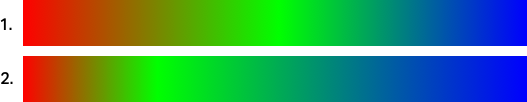
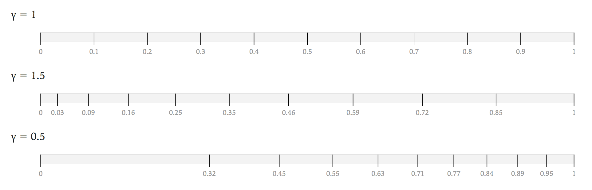

# Culori

A color library for JavaScript. Culori works across many color spaces to offer conversion, interpolation, color difference formulas, and blending functions.

It supports most color spaces and formats defined in the [CSS Colors Level 4][css4-colors] spec:

-   [Named colors][css4-named-colors]
-   [Hex colors](https://drafts.csswg.org/css-color/#hex-notation) with 3, 4, 6, or 8 digits
-   [RGB](https://drafts.csswg.org/css-color/#rgb-functions)
-   [HSL](https://drafts.csswg.org/css-color/#the-hsl-notation)
-   [HWB](https://drafts.csswg.org/css-color/#the-hwb-notation)
-   [Lab and LCh](https://drafts.csswg.org/css-color/#lab-colors)
-   [Grays](https://drafts.csswg.org/css-color/#grays)

Additional color spaces:

-   [Linear RGB](<https://en.wikipedia.org/wiki/SRGB#The_sRGB_transfer_function_(%22gamma%22)>)
-   [HSV](https://en.wikipedia.org/wiki/HSL_and_HSV) (also known as HSB)
-   [HSI](https://en.wikipedia.org/wiki/HSL_and_HSV)
-   [Cubehelix](https://www.mrao.cam.ac.uk/%7Edag/CUBEHELIX/)
-   [DIN99o][din99o]
-   [YIQ][yiq]

Culori can compute [color differences](https://en.wikipedia.org/wiki/Color_difference) based on a variety of formulas:

-   simple Euclidean distance
-   CIELAB Delta E\* metric as formulated by CIE76, CMC l:c (1984), CIE94, and CIEDE2000
-   Kotsarenko/Ramos distance

Use any of them to pick from a palette the perceptually-closest colors to a given color.

Culori is inspired by Mike Bostock's [D3.js](https://github.com/d3) and Gregor Aisch's [chroma.js](https://github.com/gka/chroma.js), from which it takes ideas and academic references.

## Foreword

If you're thinking _Do we really need another JavaScript color library?_, I hear you. Reader, for the most part, we don't. Mike Bostock's [d3-color](https://github.com/d3/d3-color), and Gregor Aisch's [chroma.js](https://github.com/gka/chroma.js) are two excellent, robust libraries that provide most of what you need for working with colors on the web. See the [Other Projects](#other-projects) section for even more libraries you can try.

Culori — from the Romanian word for ‘colors’ — started with a curiosity in _getting_ color spaces at a deeper level, maths and all; by the time I came out of this rabbit-hole, I had what I thought is a fairly fast, fairly comprehensive, set of tools for working with color, with an implementation that has certain advantages to boot.

The API tries to balance brevity, convenience and flexibility. These goals led to a functional-style API, where you transform plain objects representing colors through a series of functions. It's arguably not as readable as a [fluent API](https://en.wikipedia.org/wiki/Fluent_interface) but the lack of classes makes it more flexible and extensible (more on that later).

The _alpha_ channel, which holds a color's opacity, is treated differently than in other libaries. We don't equate an _undefined_ alpha with an alpha of 1. The hex string <kbd>#ff0000</kbd> _should_ eventually be interpreted as a fully-opaque red color, but at the color-manipulation level we want to maintain the distinction between <kbd>#ff0000</kbd> (no explicit alpha) and <kbd>#ff0000ff</kbd> (explicit alpha of 1).

## Getting Started

### Try it online

You can use [npm.runkit.com/culori](https://npm.runkit.com/culori) as a playground to test various API methods without installing culori in your project. [Observable](https://beta.observablehq.com) is another great place to tinker with the library and see the results visually.

### Install it as an npm package

<a href="https://www.npmjs.org/package/culori"></a>

culori is bundled as UMD and ES [on npm](https://npmjs.com/package/culori). Install it using `npm` or `yarn`:

```bash
# using npm
npm install culori

# using yarn
yarn add culori
```

You can then import culori in your project:

```js
// CJS style: import the whole library
let culori = require('culori');

// ES style: import individual methods
import { rgb } from 'culori';
```

### Add it via the `<script>` tag

To import culori as a `<script>` tag to use in a web page, you can load it from [unpkg](https://unpkg.com):

```html
<script src='https://unpkg.com/culori'></script>
```

## API Reference

-   [Color representation](#color-representation)
-   [Basics methods](#basic-methods)
-   [Interpolation](#interpolation)
-   [Difference](#difference)
-   [Blending](#blending)
-   [Random colors](#random-colors)
-   [Extending culori](#extending-culori)

### Color representation

Culori does not have a _Color_ class. Instead, it uses plain objects to represent colors:

```js
// A color in the RGB space
{
  mode: 'rgb',
  r: 0.1,
  g: 0.2,
  b: 1,
  alpha: 1
}
```

The object needs to have a `mode` property that identifies the color space, and values for each channel in that particular color space. See the [Color Spaces](#color-spaces) section for the channels expected of each color space. Optionally, the `alpha` property is used for the color's alpha channel.

### Basic methods

<a name="culoriParse" href="#culoriParse">#</a> culori.**parse**(_string_) → _color_ or _undefined_ [<>](https://github.com/evercoder/culori/blob/master/src/parse.js 'Source')

Parses a string and returns the corresponding _color_. The color will be in the matching color space, e.g. RGB for hex strings, HSL for `hsl(…, …, …)` strings, et cetera. If no built-in parsers can match the string, the function will return _undefined_.

```js
// named colors:
culori.parse('red');
// => { r: 1, g: 0, b: 0, mode: 'rgb' }

// hex strings:
culori.parse('#ff0000');
// => { r: 1, g: 0, b: 0, mode: 'rgb' }

// HSL colors:
culori.parse('hsl(60 50% 10% / 100%)');
// => { h: 60, s: 0.5, b: 0.1, alpha: 1, mode: 'hsl' }

// Lab colors:
culori.parse('lab(100 -50 50)');
// => { l: 100, a: -50, b: 50, mode: 'lab' }
```

<a name="culoriConverter" href="#culoriConverter">#</a> culori.**converter**(_mode = "rgb"_) → _function (color or String)_ [<>](https://github.com/evercoder/culori/blob/master/src/converter.js 'Source')

Returns a _converter_: a function that can convert any color to the _mode_ color space:

```js
let rgb = culori.converter('rgb');
let lab = culori.converter('lab');

rgb('#f0f0f0');
// => { mode: "rgb", r: 0.4980392156862745, g: 0.4980392156862745, b: 0.4980392156862745 }

lab('#f0f0f0');
// => { mode: "lab", l: 94.79624582959184, a: 0 , b: 0 }"
```

Converters accept either strings (which will be parsed with `culori.parse` under the hood) or color objects. If the `mode` key is absent from the color, it's assumed to be in the converter's color space.

The available modes (color spaces) are listed below. Each color space included by default in culori has a shortcut for its converter, i.e. you can use `culori.hsl` instead of `culori.converter('hsl')`.

| Mode        | For                        | Shortcut                      |
| ----------- | -------------------------- | ----------------------------- |
| `cubehelix` | Cubehelix color space      | culori.**cubehelix**(_color_) |
| `dlab`      | DIN99o Lab color space     | culori.**dlab**(_color_)      |
| `dlch`      | DIN99o LCh color space     | culori.**dlch**(_color_)      |
| `hsi`       | HSI color space            | culori.**hsi**(_color_)       |
| `hsl`       | HSL color space            | culori.**hsl**(_color_)       |
| `hsv`       | HSV color space            | culori.**hsv**(_color_)       |
| `hwb`       | HWB color space            | culori.**hwb**(_color_)       |
| `lab`       | Lab color space            | culori.**lab**(_color_)       |
| `lch`       | LCh color space            | culori.**lch**(_color_)       |
| `lrgb`      | Linearized RGB color space | culori.**lrgb**(_color_)      |
| `rgb`       | RGB color space            | culori.**rgb**(_color_)       |
| `yiq`       | YIQ color space            | culori.**yiq**(_color_)       |

<a name="culoriFormatter" href="#culoriFormatter">#</a> culori.**formatter**(_format = 'rgb'_) → _function (color)_ [<>](https://github.com/evercoder/culori/blob/master/src/formatter.js 'Source')

Returns a _formatter_: a function that can transform colors to a useful string representation.

```js
let hex = culori.formatter('hex');

hex('red'); // ⇒ "#ff0000"
```

Available formats:

| Format | Description                                         |
| ------ | --------------------------------------------------- |
| `hex`  | Returns the hex string for a color                  |
| `rgb`  | Returns the `rgb(…)` / `rgba(…)` string for a color |

_Reference:_ [CSSOM standard serialization](https://drafts.csswg.org/cssom/#serialize-a-css-component-value)

<a name="culoriDisplayable" href="#culoriDisplayable">#</a> culori.**displayable**(_color_ or _String_) [<>](https://github.com/evercoder/culori/blob/master/src/displayable.js 'Source')

Some color spaces (Lab and LCh in particular) allow you to express colors that can't be displayed on-screen. This function checks whether a particular color fits inside the sRGB gamut — i.e. its `r`, `g`, and `b` channels are all in the interval `[0, 1]`.

```js
culori.displayable('red'); // ⇒ true
culori.displayable('rgb(300 255 255)'); // ⇒ false
```

<a name="culoriClamp" href="#culoriClamp">#</a> culori.**clamp**(_method = 'rgb'_) → _function (color)_ [<>](https://github.com/evercoder/culori/blob/master/src/clamp.js 'Source')

Returns a function which you use to retreive a representation that's displayable on the screen for any color. There are two available methods to squeeze the color into the displayable sRGB gamut:

`method = 'rgb'` clamps the `r`, `g`, `b` channel values of the color's RGB representation to the interval `[0, 1]`.

`method = 'lch'` converts the color to LCh and finds the largest Chroma value that's displayable for the given Lightness and Hue; if not even the achromatic version (Chroma = 0) of the LCh color is displayable, it falls back to the `rgb` method.

```js
// RGB clamping
culori.clamp('rgb')('lab(50 100 100)');
// => { mode: "lab", l: 54.29173376861782, a: 80.8124553179771, b: 69.88504032350531 }

// LCh clamping
culori.clamp('lch')('lab(50 100 100)');
// =>  { mode: "lab", l:50.0000028101302, a: 63.11644430269186, b: 63.11642289997279 }
```

The clamped color will always be returned in the original color space.

<a name="culoriRound" href="#culoriRound">#</a> culori.**round**(_n = 8_) [<>](https://github.com/evercoder/culori/blob/master/src/round.js 'Source')

Returns a _rounder_: a function with which to round numbers to at most _n_ digits of precision.

```js
let approx = culori.round(4);
approx(0.38393993);
// => 0.3839
```

### Interpolation

<a name="culoriInterpolate" href="#culoriInterpolate">#</a> culori.**interpolate**(_colors_, _mode = "rgb"_, _interpolations_) [<>](https://github.com/evercoder/culori/blob/master/src/interpolate/interpolate.js 'Source')

Returns an _interpolator_ in the _mode_ color space for an array of colors: a function that accepts a value _t_ in the interval `[0, 1]` and returns the interpolated color in the _mode_ color space.

The colors in the array can be in any color space, or they can even be strings.

```js
let grays = culori.interpolate(['#fff', '#000']);
grays(0.5); // => { mode: 'rgb', r: 0.5, g: 0.5, b: 0.5 }
```

By default, colors in all spaces are interpolated linearly. You can override the way specific channels are interpolated with the _interpolations_ object, the third argument of `culori.interpolate()`.

```
let custom_interpolator = culori.interpolate(['blue', 'red'], 'lch', {
	h: culori.interpolateLinear() // long-path hue interpolation
});
```

There are a few interpolation methods available, listed below. Depending on the channel, the numeric values can be interpreted/interpolated in various _modes_. The hue channel, for example, is interpolated by taking into account the _shortest path around the hue circle_ (`interpolateHue`). And the `interpolateAlpha` mode assumes an _undefined_ alpha is `1`.

#### Color stop positions

You can specify positions of color stops to interpolate in the way they're defined in the [CSS Images Module Level 4][css-images-4] specification:

```js
culori.interpolate(['red', ['green', 0.25], 'blue']);
```

In the image below, you can see the effect of interpolating with evenly-spaced colors (1) vs. positioned colors stops (2):



To specify a positioned color stop, use an array that contains the color followed by its position. The color stops should be specified in ascending order.

For omitted (implicit) positions, we apply the rules [from the spec][css-images-4]:

1. if the first color doesn't have a position, it's assumed to be `0`; if the last color doesn't have a position, it's assumed to be `1`;
2. any other color stops that don't have a position will be evenly distributed along the gradient line between the positioned color stops.

#### Easing functions

You can add easing functions between any two colors in the array:

```js
const easeIn = t => t * t;
culori.interpolate(['red', easeIn, 'green']);
```

Any function in the _colors_ array will be interpreted as an easing function, which is (for our purposes), a function that takes an argument `t ∈ [0, 1]` and returns a value `v ∈ [0, 1]`.

Culori comes with [just a few](#built-in-easing-functions) easing functions, but you can find several online:

-   [some classic easing functions](https://gist.github.com/gre/1650294);
-   [eases](https://github.com/mattdesl/eases) by Matt DesLauriers;
-   [bezier-easing](https://github.com/gre/bezier-easing) by Gaëtan Renaudeau builds `cubic-bezier` easings as defined in the [CSS Easing Functions Level 1][css-easing-1] spec;
-   [d3-scale](https://github.com/d3/d3-scale) lets you set the scale's domain and range to `[0, 1]`.

#### Interpolation hints

Any number in he _colors_ array will be interpreted as an [interpolation hint](https://drafts.csswg.org/css-images-4/#color-stop-syntax):

```js
// interpolation hint
culori.interpolate(['red', 0.25, 'green']);
```

> 👉 As opposed to the CSS spec, interpolation hints [don't affect color stop positions](https://github.com/w3c/csswg-drafts/issues/3931) in culori.

#### Built-in easing functions

A few easing functions that come with culori:

<a name="culoriEasingMidpoint" href="#culoriEasingMidpoint">#</a> culori.**easingMidpoint**(_H = 0.5_) [<>](https://github.com/evercoder/culori/blob/master/src/easing/midpoint.js 'Source')

[Proposed here][midpoint], the `midpoint` easing function lets you shift the midpoint of a gradient like in tools such as Adobe Photoshop. You can use it with [`culori.interpolate`](#culoriInterpolate) as an alternative to interpolation hints:

```js
culori.interpolate(['red', easingMidpoint(0.25), 'blue']);
// equivalent to
culori.interpolate(['red', 0.25, 'blue']);
```

<a name="culoriEasingSmoothstep" href="#culoriEasingSmoothstep">#</a> culori.**easingSmoothstep** [<>](https://github.com/evercoder/culori/blob/master/src/easing/smoothstep.js 'Source')

The [Smoothstep][smoothstep] easing function.

<a name="culoriEasingSmootherstep" href="#culoriEasingSmootherstep">#</a> culori.**easingSmoothstep** [<>](https://github.com/evercoder/culori/blob/master/src/easing/smootherstep.js 'Source')

Smootherstep is a variant of the [Smoothstep][smoothstep] easing function.

#### Interpolation methods

You'll use these methods when you want to override how colors get interpolated in a specific color space, or when defining the default interpolation for custom color spaces.

<a name="culoriInterpolateLinear" href="#culoriInterpolateLinear">#</a> culori.**interpolateLinear**(_normalize = identity_, _γ = 1_) [<>](https://github.com/evercoder/culori/blob/master/src/interpolate/linear.js 'Source')

A linear interpolator for values in a channel. By default does not normalize the values.

<a name="culoriInterpolateSplineBasis" href="#culoriInterpolateSplineBasis">#</a> culori.**interpolateSplineBasis**(_normalize = identity_, _type = "default"_, _γ = 1_) [<>](https://github.com/evercoder/culori/blob/master/src/interpolate/splineBasis.js 'Source')

A basis spline interpolator for values in a channel. The _type_ can be one of the following:

-   `default` creates a basis spline that passes through the first and last values in the array.
-   `closed` creates a closed basis spline
-   `open` creates an open basis spline (_not yet implemented_)

<a name="culoriInterpolateSplineNatural" href="#culoriInterpolateSplineNatural">#</a> culori.**interpolateSplineNatural**(_normalize = identity_, _type = "default"_, _γ = 1_) [<>](https://github.com/evercoder/culori/blob/master/src/interpolate/splineNatural.js 'Source')

A natural spline interpolator for values in a channel. The _type_ can be one of the following:

-   `default` creates a natural spline
-   `closed` creates a closed natural spline

<a name="culoriInterpolateSplineMonotone" href="#culoriInterpolateSplineMonotone">#</a> culori.**interpolateSplineMonotone**(_normalize = identity_, _type = "default"_, _γ = 1_) [<>](https://github.com/evercoder/culori/blob/master/src/interpolate/splineMonotone.js 'Source')

A monotone spline interpolator for values in a channel. The _type_ can be one of the following:

-   `default` creates a monotone spline
-   `closed` creates a closed monotone spline
-   `open` creates an open monotone spline (_not yet implemented_)

<a name="culoriInterpolateCosine" href="#culoriInterpolateCosine">#</a> culori.**interpolateCosine**(_normalize = identity_, _γ = 1_) [<>](https://github.com/evercoder/culori/blob/master/src/interpolate/cosine.js 'Source')

Interpolates the value [using the cosine function](http://paulbourke.net/miscellaneous/interpolation/), which can offer a smoother alternative to linear interpolation.

#### Interpolation modes

By default, channel values that need to be interpolated are not normalized in any way. However, for some channels, we need to do some normalization before we interpolate the values:

<a name="culoriInterpolateHue" href="#culoriInterpolateHue">#</a> culori.**interpolateHue** [<>](https://github.com/evercoder/culori/blob/master/src/interpolate/hue.js 'Source')

Used for the hue channel in various color spaces, normalizes the array such that the interpolator takes into account the _shortest path around the hue circle_:

**hsl/definition.js**

```js
export default {
	// ...
	interpolate: {
		h: interpolateLinear(interpolateHue),
		s: interpolateLinear(),
		l: interpolateLinear(),
		alpha: interpolateLinear(interpolateAlpha)
	}
	// ...
};
```

By default, hue channels in all color spaces will use this normalization. However, the example below interpolates colors in the HSL color space by treating hues as normal numeric values instead:

```js
let hsl_long = culori.interpolate(['blue', 'red', 'green'], 'hsl', {
	h: culori.interpolateLinear()
});
```

(Notice we're not sending `culori.interpolateHue` to `culori.interpolateLinear()` as the first argument.)

<a name="culoriInterpolateAlpha" href="#culoriInterpolateAlpha">#</a> culori.**interpolateAlpha** [<>](https://github.com/evercoder/culori/blob/master/src/interpolate/alpha.js 'Source')

Used for the alpha channel in various color spaces such that `undefined` values are treated as `1` (full opacity) in some situations. This is the default for the alpha channel in all color spaces.

#### Evenly-spaced samples

<a name="culoriSamples" href="#culoriSamples">#</a> culori.**samples**(_n = 2_, _γ = 1_) [<>](https://github.com/evercoder/culori/blob/master/src/samples.js 'Source')

Returns an array of _n_ equally-spaced samples from the `[0, 1]` range, with `0` and `1` at the ends. The function also accepts a _γ_ (gamma) parameter which will map each value _t_ to _t_<sup>γ</sup>.

```js
culori.samples(3); // => [0, 0.5, 1]
culori.samples(5); // => [0, 0.25, 0.5, 0.75, 1]
```



The samples are useful for [culori.interpolate()](#culoriInterpolate) to generate color scales:

```js
let grays = culori.interpolate(['#fff', '#000']);
culori.samples(5).map(grays); // => five evenly-spaced colors
```

As with the [`interpolate()`](#culoriInterpolate) method, you can map the samples through an easing function or scale to obtain a different distribution of the samples.

```js
let culori = require('culori');
let easing = require('bezier-easing');

// Bezier easing
let bezier = easing(0, 0, 1, 0.5);
culori.samples(10).map(bezier);

// easeInQuad
culori.samples(10).map(t => t * t);
```

### Difference

These methods are concerned to finding the [distance between two colors](https://en.wikipedia.org/wiki/Color_difference) based on various formulas. Each of these formulas will return a _function (colorA, colorB)_ that lets you measure the distance between two colors.

> These are also available as a separate [D3 plugin](https://github.com/evercoder/d3-color-difference).

<a name="culoriDifferenceEuclidean" href="#culoriDifferenceEuclidean">#</a> culori.**differenceEuclidean**(_mode = 'rgb'_, _weights = [1, 1, 1, 0]_) [<>](https://github.com/evercoder/culori/blob/master/src/difference.js 'Source')

Returns a [Euclidean distance](https://en.wikipedia.org/wiki/Color_difference#Euclidean) function in a certain color space.

You can optionally assign different weights to the channels in the color space. See, for example, the [Kotsarenko/Ramos distance](#culoriDifferenceKotsarenkoRamos).

The default weights `[1, 1, 1, 0]` mean that the _alpha_, which is the fourth channel in all the color spaces culori defines, is not taken into account. Send `[1, 1, 1, 1]` as the weights to include it in the computation.

For the `h` channel in the color (in any color space that has this channel), we're using a _shortest hue distance_ to compute the hue's contribution to the distance. In spaces such as HSL or HSV, where the range of this difference is `[0, 180]` — as opposed to `[0, 1]` for the other channels — consider adjusting the weights so that the hue contributes "equally" to the distance:

```js
let hsl_distance = culori.differenceEuclidean('hsl', [
	1 / (180 * 180),
	1,
	1,
	0
]);
```

<a name="culoriDifferenceCie76" href="#culoriDifferenceCie76">#</a> culori.**differenceCie76**() [<>](https://github.com/evercoder/culori/blob/master/src/difference.js 'Source')

Computes the [CIE76][cie76] ΔE\*<sub>ab</sub> color difference between the colors _a_ and _b_. The computation is done in the Lab color space and it is analogous to [culori.differenceEuclidean('lab')](#culoriDifferenceEuclidean).

<a name="culoriDifferenceCie94" href="#culoriDifferenceCie94">#</a> culori.**differenceCie94**(_kL = 1_, _K1 = 0.045_, _K2 = 0.015_) [<>](https://github.com/evercoder/culori/blob/master/src/difference.js 'Source')

Computes the [CIE94][cie94] ΔE\*<sub>94</sub> color difference between the colors _a_ and _b_. The computation is done in the Lab color space.

<a name="culoriDifferenceCiede2000" href="#culoriDifferenceCiede2000">#</a> culori.**differenceCiede2000**(_Kl = 1_, _Kc = 1_, _Kh = 1_) [<>](https://github.com/evercoder/culori/blob/master/src/difference.js 'Source')

Computes the [CIEDE2000][ciede2000] ΔE\*<sub>00</sub> color difference between the colors _a_ and _b_ as implemented by [G. Sharma](http://www2.ece.rochester.edu/~gsharma/ciede2000/). The computation is done in the Lab color space.

Returns a [CIEDE2000](https://en.wikipedia.org/wiki/Color_difference#CIEDE2000) Delta E\* function.

<a name="culoriDifferenceCmc" href="#culoriDifferenceCmc">#</a> culori.**differenceCmc**() [<>](https://github.com/evercoder/culori/blob/master/src/difference.js 'Source')

Computes the [CMC l:c (1984)][cmc] ΔE\*<sub>CMC</sub> color difference between the colors _a_ and _b_. The computation is done in the Lab color space.

_Note:_ ΔE\*<sub>CMC</sub> is not considered a metric since it's not symmetrical, i.e. the distance from _a_ to _b_ is not always equal to the distance from _b_ to _a_. Therefore it cannot be reliably used with [culori.nearest()](#culoriNearest).

<a name="culoriDifferenceDin99o" href="#culoriDifferenceDin99o">#</a> culori.**differenceDin99o**() [<>](https://github.com/evercoder/culori/blob/master/src/difference.js 'Source')

Computes the [DIN99o][din99ode] ΔE\*<sub>99o</sub> color difference between the colors _a_ and _b_. The computation is done in the [DIN99o][din99o] color space.

<a name="culoriDifferenceKotsarenkoRamos" href="#culoriDifferenceKotsarenkoRamos">#</a> culori.**differenceKotsarenkoRamos**() [<>](https://github.com/evercoder/culori/blob/master/src/difference.js 'Source')

Computes the [Kotsarenko/Ramos][kotsarekno-ramos] color difference between the colors _a_ and _b_. This is a weighted Euclidean distance in the [YIQ][yiq] color space.

#### Nearest color(s)

<a name="culoriNearest" href="#culoriNearest">#</a> culori.**nearest**(_colors_, _metric = differenceEuclidean()_, _accessor = identity_) → _function(color, n = 1, τ = Infinity)_ [<>](https://github.com/evercoder/culori/blob/master/src/nearest.js 'Source')

For a given _metric_ color difference formula, and an array of _colors_, returns a function with which you can find _n_ colors nearest to _color_, with a maximum distance of _τ_.

Pass _n = Infinity_ to get all colors in the array with a maximum distance of _τ_.

### Blending

Color blending works as defined in the W3C [Compositing and Blending Level 2](https://drafts.fxtf.org/compositing-2/) specification.

<a name="culoriBlend" href="#culoriBlend">#</a> culori.**blend**(_colors_, _type = 'normal'_, _mode = 'rgb'_) → _color_ [<>](https://github.com/evercoder/culori/blob/master/src/blend.js 'Source')

Available blending modes:

-   `normal`
-   `multiply`
-   `screen`
-   `hard-light`
-   `overlay`
-   `darken`
-   `lighten`
-   `color-dodge`
-   `color-burn`
-   `soft-light`
-   `difference`
-   `exclusion`

> **Note:** culori currently implements the _separable_ blend modes, that is the blend modes that work on each channel in the color space independently. _color_, _hue_, _saturation_, and _lightness_ modes are not yet available.

An example of blending three colors:

```js
culori.blend(
	['rgba(255, 0, 0, 0.5)', 'rgba(0, 255, 0, 0.5)', 'rgba(0, 0, 255, 0.5)'],
	'screen'
);
// => { mode: 'rgb', alpha: 0.875, r: 0.57..., g: 0.57..., b:0.57... }
```

In addition to strings, the _type_ parameter supports a _function (b, s) → v_ that takes the values of the _backdrop_ and _source_ color to return the blended value. This allows you to write your own (separable) blending functions. For example, an _average_ blending mode:

```js
culori.blend(['red', 'green'], function average(b, s) {
	return (b + s) / 2;
});
```

### Random colors

<a name="culoriRandom" href="#culoriRandom">#</a> culori.**random**(_mode = 'rgb'_, _constraints = {}_) [<>](https://github.com/evercoder/culori/blob/master/src/random.js 'Source')

Obtain a random color from a particular color space, with optional constraints. The resulting color will be in the color space from where it has been picked.

Basic usage:

```js
culori.random();
// => { mode: 'rgb', r: 0.75, g: 0.12, b: 0.99 }
```

#### Specifying constraints

Random colors are, by definition, all over the color space and not all of them will look particularly nice. Some color spaces, such as HSL or HSV, are also biased towards colors close to black and/or white, because of the way these color spaces stretch the RGB cube into cyllinders.

For more control on how the colors are generated, you can specify constraints for each individual channel in the color space. Constraints can be either a _constant number_ or an _interval_ from where to pick the channel value:

```js
culori.random('hsv', {
	h: 120 // number,
	s: [0.25, 0.75] // interval
});
```

The _alpha_ channel is excluded by default. To obtain colors with random alpha values, include a constraint for `alpha`:

```js
culori.random('lrgb', { alpha: [0, 1] });
```

#### Displayable random colors

The value for any channel in the color space for which there are no constraints will be picked from the entire range of that channel. However, some color spaces, such as LAB or LCH, don't have explicit ranges for certain channels; for these, some approximate ranges [have been pre-computed](https://github.com/evercoder/culori/blob/master/tools/ranges.js) as the limits of the displayable sRGB gamut.

Even with these ranges in place, a combination of channel values may not be displayable. Check if that's the case with [`culori.displayable()`](#culoriDisplayable), and pass the color through [`culori.clamp()`](#culoriClamp) to obtain a displayable version.

### WCAG utilities

<a name="culoriWcagLuminance" href="#culoriWcagLuminance">#</a> culori.**wcagLuminance**(_color_) [<>](https://github.com/evercoder/culori/blob/master/src/wcag.js 'Source')

Computes the relative luminance of a color.

<a name="culoriWcagContrast" href="#culoriWcagContrast">#</a> culori.**wcagContrast**(_colorA_, _colorB_) [<>](https://github.com/evercoder/culori/blob/master/src/wcag.js 'Source')

Computes the contrast between two colors.

### Extending culori

<a name="culoriDefineMode" href="#culoriDefineMode">#</a> culori.**defineMode**(_definition_) [<>](https://github.com/evercoder/culori/blob/master/src/modes.js 'Source')

Defines a new color space through a _definition_ object. By way of example, here's the definition of the HSL color space:

```js
{
	mode: 'hsl',
	output: {
		rgb: convertHslToRgb
	},
	input: {
		rgb: convertRgbToHsl
	},
	channels: ['h', 's', 'l', 'alpha'],
	ranges: {
		h: [0, 360]
	},
	parsers: [parseHsl],
	interpolate: {
		h: interpolateLinear(interpolateHue),
		s: interpolateLinear(),
		l: interpolateLinear(),
		alpha: interpolateLinear(interpolateAlpha)
	}
}
```

The properties a definition needs are the following:

-   `mode`: the string identifier for the color space
-   `output`: a set of functions to convert from the color space we're defining to other color spaces. At least `rgb` needs to be included; in case a specific conversion pair between two color spaces is missing, RGB is used as the "buffer" for the conversion.
-   `input`: opposite of `output`; a set of function to convert from various color spaces to the color space we're defining. At least `rgb` needs to be included.
-   `channels`: a list of channels for the color space.
-   `ranges`: the ranges for values in specific channels; if left unspecified, defaults to `[0, 1]`.
-   `parsers`: any parsers for the color space that can transform strings into colors
-   `interpolate`: the default interpolations for the color space.

**Note:** The order of the items in the `channels` array matters. To keep things simple, we're making the following conventions:

-   the fourth item in the array should be `alpha`
-   any cyclical values (e.g. hue) should be identified by `h`, in the range `[0, 360)`

These constrains make sure `differenceEuclidean()` works as expected.

## Color Spaces

### RGB

> 🕳 expand this section

### LRGB (Linear RGB)

> 🕳 expand this section

> 📖 See Jamie Wong's [excellent deep dive](http://jamie-wong.com/post/color/) into color.

### HSL / HSV / HSI

[HSL, HSV, and HSI](https://en.wikipedia.org/wiki/HSL_and_HSV) are a family of representations of the RGB color space, created in 1970 to provide color spaces more closely aligned to how humans perceive colors.

> 💡 In this family of color spaces, the _hue_ is undefined for achromatic colors (i.e. shades of gray).

#### `hsl`

| Channel | Range      | Description       |
| ------- | ---------- | ----------------- |
| `h`     | `[0, 360)` | Hue               |
| `s`     | `[0, 1]`   | Saturation in HSL |
| `l`     | `[0, 1]`   | Lightness         |

The figure below shows a slice of the HSL color space for a particular hue:


#### `hsv`

| Channel | Range      | Description       |
| ------- | ---------- | ----------------- |
| `h`     | `[0, 360)` | Hue               |
| `s`     | `[0, 1]`   | Saturation in HSV |
| `v`     | `[0, 1]`   | Value             |

The figure below shows a slice of the HSV color space for a particular hue:


#### `hsi`

| Channel | Range      | Description       |
| ------- | ---------- | ----------------- |
| `h`     | `[0, 360)` | Hue               |
| `s`     | `[0, 1]`   | Saturation in HSI |
| `i`     | `[0, 1]`   | Intensity         |

The figure below shows a slice of the HSI color space for a particular hue:


> 💡 While the _hue_ in this family of color spaces retains its value in all of them, the _saturation_ in HSL is **not interchangeable** with the _saturation_ from HSV, nor HSI — they're computed differently, depending on the color space.

### HWB

[The HWB color space](https://en.wikipedia.org/wiki/HWB_color_model) was developed by Alvy Ray Smith, who also created the HSV color space. It's meant to be more intuitive for humans to use and faster to compute.

**References:**

-   Smith, Alvy Ray (1996) — ["HWB — A More Intuitive Hue-Based Color Model"](http://alvyray.com/Papers/CG/HWB_JGTv208.pdf), Journal of Graphics, GPU and Game tools.

### Lab / LCh (CIE)

> As defined in the [CSS Color Module Level 4 spec](https://drafts.csswg.org/css-color/#lab-colors), we use the [D50 illuminant](https://en.wikipedia.org/wiki/Standard_illuminant) as a reference white for these color spaces.

#### `lab`

| Channel | Range                | Description           |
| ------- | -------------------- | --------------------- |
| `l`     | `[0, 100]`           | Lightness             |
| `a`     | `[-79.167, 93.408]`  | Green–red component   |
| `b`     | `[-111.859, 93.246]` | Blue–yellow component |

#### `lch`

| Channel | Range          | Description |
| ------- | -------------- | ----------- |
| `l`     | `[0, 100]`     | Lightness   |
| `c`     | `[0, 131.008]` | Chroma      |
| `h`     | `[0, 360)`     | Hue         |

> 💡 The range for the `a` and `b` channels in Lab, and the `c` channel in LCh, depend on the specific implementation. I've obtained the ranges from the tables above by converting all sRGB colors defined by `r, g, b ∈ ℕ ⋂ [0, 255]` into Lab and LCh respectively.

### DIN99 Lab / LCh

The [DIN99][din99o] color space "squishes" the CIE Lab color space to obtain an [effective color difference](#culoriDifferenceDin99o) metric that can be expressed as a simple Euclidean distance. We implement the latest iteration of the the standard, DIN99o.

#### `dlab`

| Channel | Range               | Description |
| ------- | ------------------- | ----------- |
| `l`     | `[0, 100]`          | Lightness   |
| `a`     | `[-39.229, 45.166]` |
| `b`     | `[-43.002, 44.424]` |

#### `dlch`

| Channel | Range         | Description |
| ------- | ------------- | ----------- |
| `l`     | `[0, 100]`    | Lightness   |
| `c`     | `[0, 50.944]` | Chroma      |
| `h`     | `[0, 360)`    | Hue         |

**References:**

-   ["Industrial Color Physics"](https://www.springer.com/us/book/9781441911964), Georg A. Klein, Springer (2010)

### YIQ

[YIQ](yiq) is the color space used by the NTSC color TV system. It contains the following channels:

| Channel | Range             | Description                    |
| ------- | ----------------- | ------------------------------ |
| Y       | `[0, 1]`          | Luma                           |
| I       | `[-0.593, 0.593]` | In-phase (orange-blue axis)    |
| Q       | `[-0.520, 0.520]` | Quadrature (green-purple axis) |

### Cubehelix

[The Cubehelix color scheme](https://www.mrao.cam.ac.uk/~dag/CUBEHELIX/) was described by Dave Green in this paper:

-   Green, D. A., 2011, [_"A colour scheme for the display of astronomical intensity images"_](http://astron-soc.in/bulletin/11June/289392011.pdf), Bulletin of the Astronomical Society of India, 39, 289. ([2011BASI...39..289G](https://ui.adsabs.harvard.edu/#abs/2011BASI...39..289G) at [ADS](https://ui.adsabs.harvard.edu/))

It was expanded into a color space by [Mike Bostock](https://en.wikipedia.org/wiki/Mike_Bostock) and [Jason Davies](https://www.jasondavies.com/) in [D3](https://github.com/d3/d3-color).

#### `cubehelix`

The channels in the `cubehelix` color space maintain the conventions from D3, namely:

| Channel | Range         | Description                                                              |
| ------- | ------------- | ------------------------------------------------------------------------ |
| `h`     | `[0, 360)`    | Hue (Based on _start color_ and _rotations_ as defined in Green's paper) |
| `s`     | `[0, 4.6143]` | Saturation (Called _hue_ in op. cit.)                                    |
| `l`     | `[0, 1]`      | Lightness                                                                |

## Related

### Extras

These projects add more functionality to culori, but they're separate as to keep the core bundle small:

-   **[culori-scales](https://github.com/evercoder/culori-scales)** — color scales (ColorBrewer, matplotlib, etc).
-   **[culori-names](https://github.com/evercoder/culori-names)** — More named colors, from a variety of sources.

### Products using culori

-   **[Moqups](https://moqups.com)** — all our color-manipulation functions are handled by culori.
-   **[Dainty](https://dainty-vs.now.sh)** — Dainty is a configurable refined and balanced color theme for Visual Studio using Culori’s CIELAB capabilities for generating and processing colors.

> Does your product/project use culori? Create a PR and add yourself to this list!

### Other projects

Besides [d3-color](https://github.com/d3/d3-color) and [chroma.js](https://github.com/gka/chroma.js), some other popular libraries you may want to look at:

-   [TinyColor](https://github.com/bgrins/TinyColor) by [Brian Grinstead](http://briangrinstead.com)
-   [color](https://github.com/Qix-/color) by Heather Arthur
-   [color.js](https://github.com/brehaut/color-js) by Andrew Brehaut et al
-   [chromatist](https://github.com/jrus/chromatist) by [Jacob Rus](http://www.hcs.harvard.edu/~jrus/)
-   [gradstop.js](https://github.com/Siddharth11/gradstop) by [Siddharth Parmar](https://github.com/Siddharth11)

## Colophon

-   _Author_ [Dan Burzo](http://danburzo.ro)
-   _License_ [MIT](./LICENSE)
-   _Inspired by_ [d3-color](https://github.com/d3/d3-color), [d3-interpolate](https://github.com/d3/d3-interpolate), [chroma.js](https://github.com/gka/chroma.js)
-   _Dependencies_ none
-   _Bundled with_ [rollup](https://github.com/rollup/rollup), [buble](https://github.com/Rich-Harris/buble), [terser](https://github.com/terser-js/terser)
-   _Tested with_ [tape](https://github.com/substack/tape)
-   _Formatted with_ [prettier](https://prettier.io)

[cie76]: https://en.wikipedia.org/wiki/Color_difference#CIE76
[cie94]: https://en.wikipedia.org/wiki/Color_difference#CIE94
[ciede2000]: https://en.wikipedia.org/wiki/Color_difference#CIEDE2000
[cmc]: https://en.wikipedia.org/wiki/Color_difference#CMC_l:c_(1984)
[css-easing-1]: http://drafts.csswg.org/css-easing-1
[css-images-4]: https://drafts.csswg.org/css-images-4/#color-stop-syntax
[css4-colors]: https://drafts.csswg.org/css-color/
[css4-named-colors]: https://drafts.csswg.org/css-color/#named-colors
[din99o]: https://de.wikipedia.org/wiki/DIN99-Farbraum
[din99ode]: https://de.wikipedia.org/wiki/DIN99-Farbraum#Farbabstandsformel
[kotsarekno-ramos]: http://www.progmat.uaem.mx:8080/artVol2Num2/Articulo3Vol2Num2.pdf
[midpoint]: https://github.com/w3c/csswg-drafts/issues/3935
[smoothstep]: https://en.wikipedia.org/wiki/Smoothstep
[yiq]: https://en.wikipedia.org/wiki/YIQ
