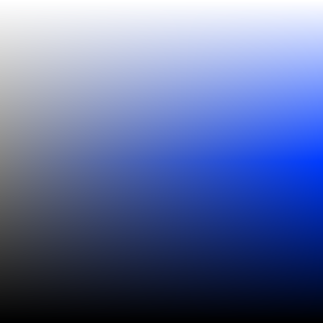

# Culori

⚠ _Until the first stable release (1.0.0) the API is considered unstable and will be changing quite a bit. Use cautiously!_

Culori is a general-purpose color library for JavaScript. It incorporates, and extends, ideas from Mike Bostock's [D3.js](https://github.com/d3) and Gregor Aisch's [chroma.js](https://github.com/gka/chroma.js).

__Color Spaces__. Culori supports all the formats defined in the [CSS Colors Level 4][css4-colors]: [Named colors][css4-named-colors], [Hex colors](https://drafts.csswg.org/css-color/#hex-notation) (3 to 8 digits), [RGB](https://drafts.csswg.org/css-color/#rgb-functions), [HSL](https://drafts.csswg.org/css-color/#the-hsl-notation), [HWB](https://drafts.csswg.org/css-color/#the-hwb-notation), [Lab and LCh](https://drafts.csswg.org/css-color/#lab-colors), and [Grays](https://drafts.csswg.org/css-color/#grays). Additionally, the [Linear RGB](https://en.wikipedia.org/wiki/SRGB#The_sRGB_transfer_function_(%22gamma%22)), [HSV](https://en.wikipedia.org/wiki/HSL_and_HSV) (also known as HSB), [HSI](https://en.wikipedia.org/wiki/HSL_and_HSV), and [Cubehelix](https://www.mrao.cam.ac.uk/%7Edag/CUBEHELIX/) color spaces are supported.

__Color Differences__. Culori can compute [color differences](https://en.wikipedia.org/wiki/Color_difference) with either a simple Euclidean distance or the CIELAB Delta E* metric as formulated by CIE76, CIE94, CIEDE2000 and CMC l:c (1984). They're also available [as a D3 plugin](https://github.com/evercoder/d3-color-difference). It can also find the closest N colors from a set of colors based on any of these differences.

## Foreword

If you're thinking _Do we really need another JavaScript color library?_, I hear you. Reader, for the most part, we don't. Mike Bostock's [d3-color](https://github.com/d3/d3-color), and Gregor Aisch's [chroma.js](https://github.com/gka/chroma.js) are two robust libraries that provide most of what you need for working with colors on the web<sup>1</sup>. I'll admit culori<sup>2</sup> is foremost a reflection of my own curiousity in understanding color spaces at a deeper level. But it also ended up a fairly fast, and fairly comprehensive, toolkit for manipulating colors — and with an implementation that has certain advantages.

The _alpha_ channel which governs a color's opacity is treated differently than in other libaries, in that we don't equate an _undefined_ alpha with an alpha of 1. The hex string <kbd>#ff0000</kbd> _should_ eventually be interpreted as a fully-opaque red color, but at the color-manipulation level we want to draw the distinction between <kbd>#ff0000</kbd> and <kbd>#ff0000ff</kbd>, which has an explicit alpha channel. 

When developing the API, I tried to balance brevity, convenience and flexibility. It ended up a more-or-less functional API, i.e. a collection of functions you can pipe data through. It's not as readable as a fluent API where you chain methods, but it's much more flexible, I think.

---

<sup>1</sup> Other popular libraries you may want to look at are [TinyColor](https://github.com/bgrins/TinyColor) by [Brian Grinstead](http://briangrinstead.com), [color](https://github.com/Qix-/color) by Heather Arthur, [color.js](https://github.com/brehaut/color-js) by Andrew Brehaut et al, and [chromatist](https://github.com/jrus/chromatist) by [Jacob Rus](http://www.hcs.harvard.edu/~jrus/).

<sup>2</sup> from the Romanian word for ‘colors’.

## Getting Started

### Try it online

You can use [npm.runkit.com/culori](https://npm.runkit.com/culori) as a playground to test various methods in from the API without installing culori in your project.


### Install as NPM package

```bash
npm install culori
```

You can either `require` or `import` culori in your project:

```js
// either
var culori = require('culori');

// or
import { rgb } from 'culori';
```

### Add culori via the `<script>` tag

To import culori as a `<script>` tag to use in a web page, load it from [unpkg](https://unpkg.com):

* https://unpkg.com/culori/build/culori.js
* https://unpkg.com/culori/build/culori.min.js

If you prefer not to use a Content Delivery Network such as unpkg, just save the one of the JS files linked above to your project.

## API Reference

* [Color representation](#color-representation)
* [A note on the API](#a-note-on-the-api)
* [Basics methods](#basic-methods)
* [Interpolation](#interpolation)
* [Difference](#difference)

### Color representation

Culori does not have a _Color_ class. Instead, it uses plain objects to represent colors:

```js
// A color in the RGB space
{
  mode: 'rgb',
  r: 0.1,
  g: 0.2,
  b: 1,
  alpha: 1
}
```

The object needs to have a `mode` property that identifies the color space, and values for each channel in that particular color space. See the [Color Spaces](#color-spaces) section for the channels expected of each color space. Optionally, the `alpha` property is used for the color's alpha channel.

### A note on the API

TODO explain Functional style and its benefits.

### Basic methods

<a name="culoriParse" href="#culoriParse">#</a> culori.__parse__(_string_) → _color_ or _undefined_ [<>](https://github.com/evercoder/culori/blob/master/src/parse.js "Source")

Parses a string and returns the corresponding _color_. The color will be in the matching color space, e.g. RGB for hex strings, HSL for `hsl(…, …, …)` strings, et cetera. If no built-in parsers can match the string, the function will return _undefined_.

```js
// named colors
culori.parse('red'); // ⇒ { r: 1, g: 0, b: 0, mode: 'rgb' }

// hex strings
culori.parse('#ff0000'); // ⇒ { r: 1, g: 0, b: 0, mode: 'rgb' }

// HSL color
culori.parse('hsl(60 50% 10% / 100%)'); // ⇒ { h: 60, s: 0.5, b: 0.1, alpha: 1, mode: 'hsl' }

// Lab color
culori.parse('lab(100 -50 50)'); // ⇒ { l: 100, a: -50, b: 50, mode: 'lab' }
```

<a name="culoriConverter" href="#culoriConverter">#</a> culori.__converter__(_mode = "rgb"_) → _function (color or String)_ [<>](https://github.com/evercoder/culori/blob/master/src/converter.js "Source")

Returns a function that can then convert any color to the _mode_ color space:

```js
var rgb = culori.converter('rgb');

rgb('#f0f0f0'); // ⇒ { "mode": "rgb", "r": 0.4980392156862745, "g": 0.4980392156862745, "b": 0.4980392156862745 }
```

Converters accept either strings (which will be parsed with `culori.parse`) or color objects. If the `mode` key is absent from the color, it's assumed to be in the converter's color space.

The available modes (color spaces) are listed below. Each color space has a convenience method for converting to that color space.

Mode | For | Shortcut
---- | --- | --------
`rgb` | RGB color space | __culori__( _color_ )  and culori.__rgb__( _color_ )
`hsl` | HSL color space | culori.__hsl__(_color_) 
`hsv` | HSV color space | culori.__hsv__(_color_)
`hsi` | HSI color space | culori.__hsi__(_color_)
`hwb` | HWB color space | culori.__hwb__(_color_)
`lab` | Lab color space | culori.__lab__(_color_) 
`lch` | LCh color space | culori.__lch__(_color_)
`lrgb`| Linearized RGB color space | culori.__lrgb__(_color_)
`cubehelix` | Cubehelix color space | culori.__cubehelix__(_color_)
`dlab` | DIN99o Lab color space | culori.__dlab__(_color_)
`dlch` | DIN99o LCh color space | culori.__dlch__(_color_)

<a name="culoriFormatter" href="#culoriFormatter">#</a> culori.__formatter__(_format = 'rgb'_) → _function (color)_ [<>](https://github.com/evercoder/culori/blob/master/src/formatter.js "Source")

Returns a formatter function that can transform colors to useful string representations. 

```js
let hex = culori.formatter('hex');

hex('red'); // ⇒ "#ff0000"
```

Available formats:

Format | Description
------ | -----------
`hex` | Returns the hex string for a color
`rgb` | Returns the `rgb(…)` / `rgba(…)` string for a color

<a name="culoriDisplayable" href="#culoriDisplayable">#</a> culori.__displayable__(_color_ or _String_) [<>](https://github.com/evercoder/culori/blob/master/src/displayable.js "Source")

For some color spaces — particularly Lab and LCh — not all colors that can be expressed can be displayed on-screen. This function lets you check whether a particular color fits inside the sRGB gamut, i.e. that its `r`, `g`, and `b` channels are in the interval `[0, 1]`.

```js
culori.displayable('red'); // ⇒ true
culori.displayable('rgb(300 255 255)'); // ⇒ false
```

<a name="culoriClamp" href="#culoriClamp">#</a> culori.__clamp__(_method = 'rgb'_) → _function (color)_ [<>](https://github.com/evercoder/culori/blob/master/src/clamp.js "Source")

Returns a function which you can then use to retreive a representation of any color that's displayable on the screen, i.e. fits within the sRGB gamut. There are two available methods:

* `method = 'rgb'` clamps the `r`, `g`, `b` channel values of the color's RGB representation to the interval `[0, 1]`;
* `method = 'lch'` converts the color to the LCh space and finds the largest Chroma channel value that's displayable for the given Lightness and Hue; if not even the achromatic version (Chroma = 0) of the LCh color is displayable, it falls back to the `rgb` method.

```js
culori.clamp('lch')('lch(50 120 5)'); // ⇒ { mode: 'lch', l: 50, c: 77.48291015625, h: 5 }
```

<a name="culoriRound" href="#culoriRound">#</a> culori.__round__(_n = 8_) [<>](https://github.com/evercoder/culori/blob/master/src/round.js "Source")

A (rather miscellaneous) utility that returns a function with which to round numbers to at most _n_ digits of precision.

```js
let approximate = culori.round(4);

approximate(0.38393993); // => 0.3839
```

### Interpolation

<a name="culoriInterpolate" href="#culoriInterpolate">#</a> culori.__interpolate__(_colors_, _mode = "rgb"_) [<>](https://github.com/evercoder/culori/blob/master/src/interpolate/interpolate.js "Source")

Returns an interpolator between an array of colors in the _mode_ color space.

<a name="culoriSamples" href="#culoriSamples">#</a> culori.__samples__(_n = 2_, _γ = 1_) [<>](https://github.com/evercoder/culori/blob/master/src/samples.js "Source")

Returns an array of _n_ equally-spaced samples from the `[0, 1]` range, with `0` and `1` at the ends. The function also accepts a _γ_ (gamma) parameter which will map each value _t_ to _t_<sup>γ</sup>.

```js
culori.samples(3); // => [0, 0.5, 1]
culori.samples(5); // => [0, 0.25, 0.5, 0.75, 1]
```

The samples are useful for [culori.interpolate()](#culoriInterpolate) to generate color scales:

```js
let grays = culori.interpolate(['#fff', '#000']);
samples(5).map(grays);
```

#### Interpolation functions

<a name="culoriInterpolateFunctionLinear" href="#culoriInterpolateFunctionLinear">#</a> culori.__interpolateFunctionLinear__ [<>](https://github.com/evercoder/culori/blob/master/src/interpolate/interpolateFunctionLinear.js "Source")

<a name="culoriInterpolateFunctionSpline" href="#culoriInterpolateFunctionSpline">#</a> culori.__interpolateFunctionSpline__ [<>](https://github.com/evercoder/culori/blob/master/src/interpolate/interpolateFunctionSpline.js "Source")

<a name="culoriInterpolateFunctionMonotone" href="#culoriInterpolateFunctionMonotone">#</a> culori.__interpolateFunctionMonotone__ [<>](https://github.com/evercoder/culori/blob/master/src/interpolate/interpolateFunctionMonotone.js "Source")

<a name="culoriInterpolateFunctionCosine" href="#culoriInterpolateFunctionCosine">#</a> culori.__interpolateFunctionCosine__ [<>](https://github.com/evercoder/culori/blob/master/src/interpolate/interpolateFunctionCosine.js "Source")

#### Interpolation modes

<a name="culoriInterpolateNumber" href="#culoriInterpolateNumber">#</a> culori.__interpolateNumber__ [<>](https://github.com/evercoder/culori/blob/master/src/interpolate/interpolateNumber.js "Source")

<a name="culoriInterpolateHue" href="#culoriInterpolateHue">#</a> culori.__interpolateHue__ [<>](https://github.com/evercoder/culori/blob/master/src/interpolate/interpolateHue.js "Source")

<a name="culoriInterpolateNumber" href="#culoriInterpolateNumber">#</a> culori.__interpolateAlpha__ [<>](https://github.com/evercoder/culori/blob/master/src/interpolate/interpolateNumber.js "Source")

### Difference

These methods are concerned to finding the [distance between two colors](https://en.wikipedia.org/wiki/Color_difference) based on various formulas. Each of these formulas will return a _function (colorA, colorB)_ that lets you measure the distance between two colors. Also available as a separate [d3 plugin](https://github.com/evercoder/d3-color-difference).

<a name="culoriDifferenceEuclidean" href="#culoriDifferenceEuclidean">#</a> culori.__differenceEuclidean__(_mode = 'rgb'_) [<>](https://github.com/evercoder/culori/blob/master/src/difference.js "Source")

Returns a [Euclidean distance](https://en.wikipedia.org/wiki/Color_difference#Euclidean) function in a certain color space.

<a name="culoriDifferenceCie76" href="#culoriDifferenceCie76">#</a> culori.__differenceCie76__() [<>](https://github.com/evercoder/culori/blob/master/src/difference.js "Source")

Computes the [CIE76][CIE76] ΔE\*<sub>ab</sub> color difference between the colors _a_ and _b_. The computation is done in the Lab color space and it is analogous to [culori.differenceEuclidean('lab')](#culoriDifferenceEuclidean).

<a name="culoriDifferenceCie94" href="#culoriDifferenceCie94">#</a> culori.__differenceCie94__(_kL = 1_, _K1 = 0.045_, _K2 = 0.015_) [<>](https://github.com/evercoder/culori/blob/master/src/difference.js "Source")

Computes the [CIE94][CIE94] ΔE\*<sub>94</sub> color difference between the colors _a_ and _b_. The computation is done in the Lab color space.

<a name="culoriDifferenceCiede2000" href="#culoriDifferenceCiede2000">#</a> culori.__differenceCiede2000__(_Kl = 1_, _Kc = 1_, _Kh = 1_)  [<>](https://github.com/evercoder/culori/blob/master/src/difference.js "Source")

Computes the [CIEDE2000][CIEDE2000] ΔE\*<sub>00</sub> color difference between the colors _a_ and _b_ as implemented by [G. Sharma](http://www2.ece.rochester.edu/~gsharma/ciede2000/). The computation is done in the Lab color space.

Returns a [CIEDE2000](https://en.wikipedia.org/wiki/Color_difference#CIEDE2000) Delta E* function.

<a name="culoriDifferenceCmc" href="#culoriDifferenceCmc">#</a> culori.__differenceCmc__() [<>](https://github.com/evercoder/culori/blob/master/src/difference.js "Source")

Computes the [CMC l:c (1984)][CMC] ΔE\*<sub>CMC</sub> color difference between the colors _a_ and _b_. The computation is done in the Lab color space.

_Note:_ ΔE\*<sub>CMC</sub> is not considered a metric since it's not symmetrical, i.e. the distance from _a_ to _b_ is not always equal to the distance from _b_ to _a_. Therefore it cannot be reliably used with [culori.nearest()](#culoriNearest).

<a name="culoriDifferenceDin99o" href="#culoriDifferenceDin99o">#</a> culori.__differenceDin99o__() [<>](https://github.com/evercoder/culori/blob/master/src/difference.js "Source")

Computes the [DIN99o][DIN99oDE] ΔE\*<sub>99o</sub> color difference between the colors _a_ and _b_. The computation is done in the [DIN99o][DIN99o] color space.

#### Nearest color(s)

<a name="culoriNearest" href="#culoriNearest">#</a> culori.__nearest__(_colors_, _metric = differenceEuclidean()_, _accessor = identity_) → _function(color, n = 1, τ = Infinity)_ [<>](https://github.com/evercoder/culori/blob/master/src/nearest.js "Source")

For a given _metric_ color difference formula, and an array of _colors_, returns a function with which you can find _n_ colors nearest to _color_, with a maximum distance of _τ_.

Pass _n = Infinity_ to get all colors in the array with a maximum distance of _τ_.

## Color Spaces

TODO

### HSL

The figure above shows a slice of the HSL color space for a particular hue:



### HSV

The figure above shows a slice of the HSV color space for a particular hue:


### HSI

The figure above shows a slice of the HSI color space for a particular hue:


## Culori Recipes

#### Relative luminance of a color

The [relative luminance](https://en.wikipedia.org/wiki/Relative_luminance) of a color is defined as:

```js
L = 0.2126 * R + 0.7152 * G + 0.0722 * B
```

Where R, G, and B are the components from the LRGB color space.

To compute it in culori:

```js
function luminance(color) {
  let c = culori.lrgb(color);
  return 0.2126 * c.r + 0.7152 * c.g + 0.0722 * c.b;
}
```

__Note:__ The WCAG defines the luminance using a [deprecated value](https://github.com/w3c/wcag/issues/236#issuecomment-379526596) for converting sRGB to LRGB. If you'd like a strict implementation, you'll need to write your own sRGB → LRGB conversion.

#### Contrast ratio

Using the `luminance()` function above, the `contrast()` ratio is simply the ratio between the luminances of two colors, with the values shifted by 0.05 to avoid division by zero when comparing against black.

```js
function contrast(colorA, colorB) {
  let L1 = luminance(colorA);
  let L2 = luminance(colorB);
  return (L1 + 0.05) / (L2 + 0.05);
}
```

## Extending culori

TODO

## See also

These libraries add more functionality to culori:

* [culori-scales](https://github.com/evercoder/culori-scales) — color scales (ColorBrewer, matplotlib, etc.)
* [culori-names](https://github.com/evercoder/culori-names) — more color names

## Further reading

* [HSL and HSV](https://en.wikipedia.org/wiki/HSL_and_HSV) on Wikipedia
* [CSS Color Module Level 4][css4-colors]
* [CSSOM standard serialization](https://drafts.csswg.org/cssom/#serialize-a-css-component-value)

## Colophon

* _Author_ [Dan Burzo](http://danburzo.ro)
* _License_ [MIT](./LICENSE)
* _Inspired by_ [d3-color](https://github.com/d3/d3-color), [d3-interpolate](https://github.com/d3/d3-interpolate), [chroma.js](https://github.com/gka/chroma.js)
* _Dependencies_ none
* _Bundled with_ [rollup](https://github.com/rollup/rollup), [buble](https://github.com/Rich-Harris/buble), [terser](https://github.com/terser-js/terser)
* _Tested with_ [tape](https://github.com/substack/tape)


[css4-colors]: https://drafts.csswg.org/css-color/
[css4-named-colors]: https://drafts.csswg.org/css-color/#named-colors

[CIE76]: https://en.wikipedia.org/wiki/Color_difference#CIE76
[CIE94]: https://en.wikipedia.org/wiki/Color_difference#CIE94
[CIEDE2000]: https://en.wikipedia.org/wiki/Color_difference#CIEDE2000
[CMC]: https://en.wikipedia.org/wiki/Color_difference#CMC_l:c_(1984)
[DIN99o]: https://de.wikipedia.org/wiki/DIN99-Farbraum
[DIN99oDE]: https://de.wikipedia.org/wiki/DIN99-Farbraum#Farbabstandsformel