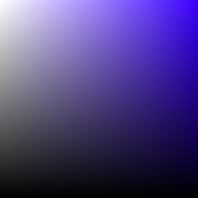

TODO

## HSL

The figure above shows a slice of the HSL color space for a particular hue:

## HSV

The figure above shows a slice of the HSV color space for a particular hue:

## HSI

The figure above shows a slice of the HSI color space for a particular hue:

